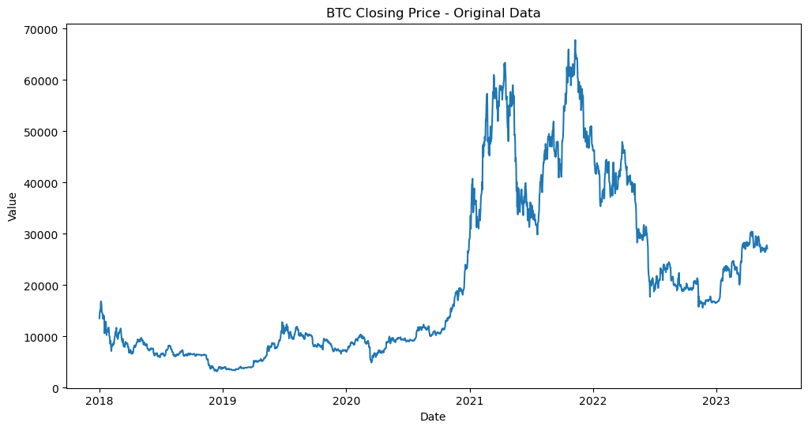
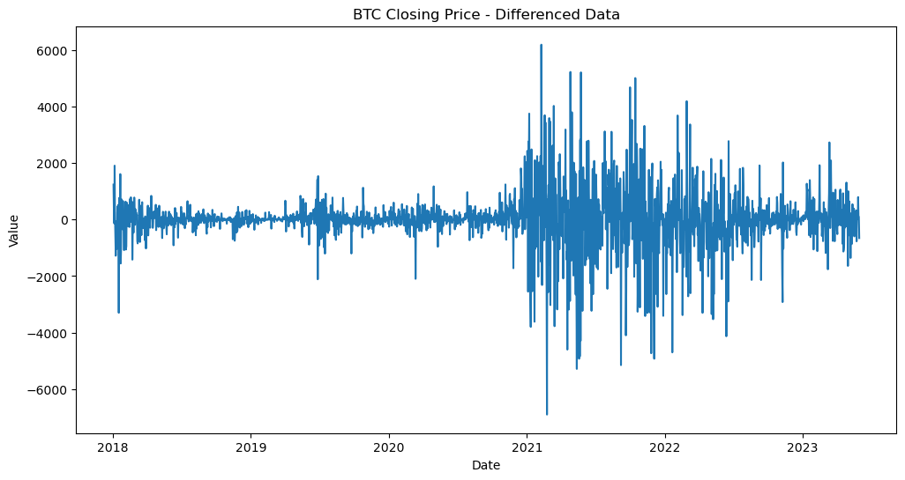
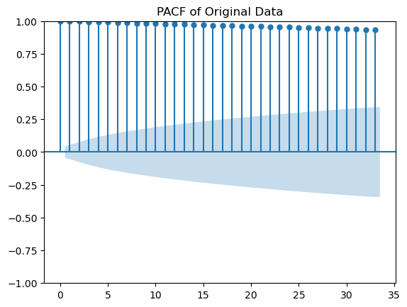
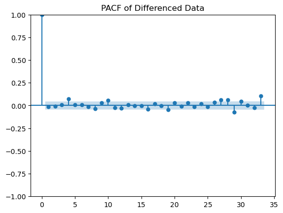
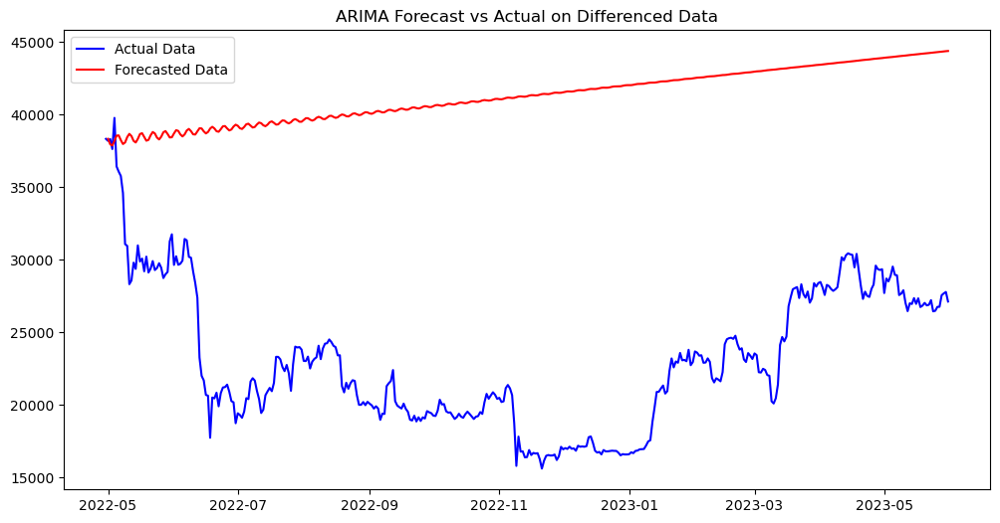
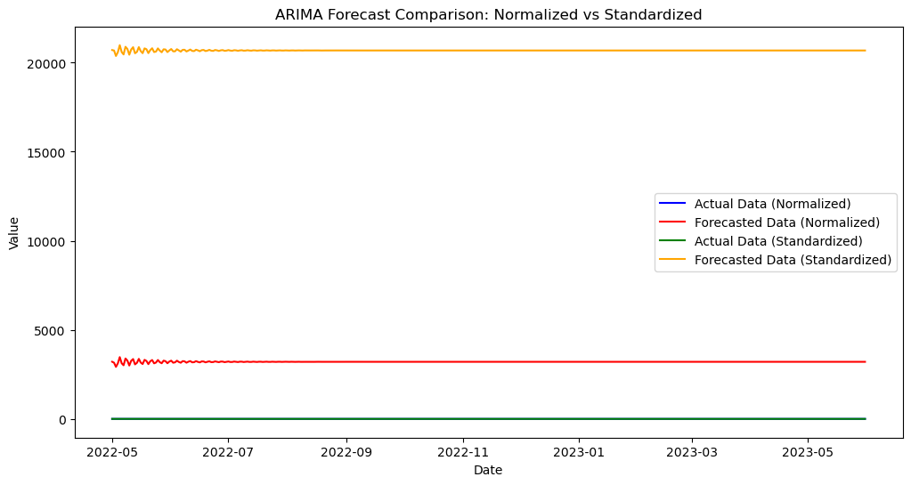
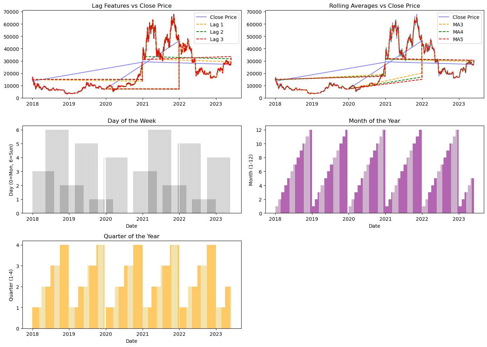

# Crypto Time Series Analysis

## Introduction
Welcome to the Crypto Time Series Analysis repository! This project focuses on analyzing Bitcoin (BTC) closing prices to identify trends and forecast future movements. By leveraging feature engineering and various predictive models, including ARIMA and Random Forest Regressor, this analysis aims to evaluate the performance of different forecasting techniques, providing actionable insights for investors and traders.

**_Disclaimer_**: _All datasets and analyses are for educational purposes only and do not represent any financial advice._

## Data Sources
**BTC Closing Prices**: The primary dataset used for this analysis is the "BTC.csv" file, which contains historical data on Bitcoin closing prices.

## Tools
- **Python** - Data processing, analysis, and model implementation
- **Pandas** - Data manipulation and analysis
- **Matplotlib/Seaborn** - Data visualization
- **Statsmodels** - Time series analysis and modeling
- **Scikit-learn** - Machine learning model implementation

## Data Cleaning/Processing
The dataset was cleaned and processed to handle missing values and outliers. Key steps included:
- Sorting the data by date and ensuring it has a daily frequency.
- Forward filling missing values to maintain continuity.
- Performing differencing to achieve stationarity for time series analysis.

## Problem Statement
1. How can we effectively forecast Bitcoin closing prices using historical data?
2. What impact does feature engineering have on model performance?
3. Which forecasting model provides the best accuracy in predicting future prices?
4. How do various time series models compare in terms of their predictive capabilities?

## Exploratory Data Analysis
Exploratory Data Analysis (EDA) involved visualizing trends in the Bitcoin closing prices, identifying patterns, and understanding the relationships between engineered features and the target variable.

### Key Findings from EDA:
- **Trend Identification**: 
  - Significant price increase from early 2020 to late 2021.
  - Sharp decline observed in the first half of 2022.
  
- **Volatility Analysis**: 
  - High volatility during 2020-2021 due to global market uncertainties.
  - Fluctuations exceeded 50%, with another volatile phase in early 2022.

- **Seasonality**: 
  - Higher price movements consistently noted in Q4 (October to December) across multiple years.

- **Stationarity**: 
  - ADF test showed the time series is non-stationary. Differencing was applied to achieve stationarity for modeling.

## Skills/Concepts Demonstrated
### Python Features Utilized:
1. Data manipulation with Pandas
2. Time series analysis techniques
3. Model evaluation metrics
4. Data visualization with Matplotlib and Seaborn

### Data Analysis Tools/Techniques:
1. Feature Engineering
2. Time Series Forecasting
3. Model Comparison
4. Statistical Analysis

## Model Implementation
### ARIMA Model
- **Fitting Process**: Employed differencing to ensure stationarity and used ADF tests to validate it.
- **Parameter Selection**: Automated ARIMA order selection based on AIC criterion.
- **Forecasting**: Utilized the fitted model to forecast future values.

## Model Implementation
### ARIMA Model
- **Fitting Process**: Employed differencing to ensure stationarity and used ADF tests to validate it.
- **Parameter Selection**: Automated ARIMA order selection based on AIC criterion.
- **Multiple Model Execution**: Executed ARIMA models on differenced, standardized, and normalized data to evaluate performance across different preprocessing methods.

#### Results from ARIMA:
- Best ARIMA Order for Differenced Data: **(2, 0, 2)**
  - Root Mean Squared Error (RMSE): **18980.43**
- Best ARIMA Order for Normalized Data: **(3, 0, 4)**
  - RMSE: **20345.67**
- Best ARIMA Order for Standardized Data: **(3, 0, 4)**
  - RMSE: **5281.48**

### Random Forest Regressor
- Implemented feature engineering to create lagged features and rolling statistics.
- Defined the target variable (closing price) and the relevant features.
- Evaluated the model's performance and analyzed feature importance.

#### Results from Random Forest:
- Mean Squared Error: **773219.72**
- Root Mean Squared Error (RMSE): **879.33**
- Top Features: 
  - lag1 (50.27%)
  - MA3 (49.46%)

## Conclusion
After evaluating both ARIMA and Random Forest models, the **Random Forest model** achieved a lower Root Mean Squared Error (RMSE) of **879.33**, while the best-performing ARIMA model on standardized data had an RMSE of **5281.48**. This indicates that the Random Forest model provided superior accuracy for predicting Bitcoin closing prices in this analysis. 

Therefore, for time series forecasting in this context, the **Random Forest model is recommended** due to its better performance compared to the ARIMA models. The Random Forest model also offers insights into feature importance, which can be beneficial for further analysis and decision-making.

## Visualization
The project includes various visualizations to illustrate trends and model performance:

1. **BTC Closing Price**: This plot captures the historical closing prices of Bitcoin over time, showcasing its volatility and overall trend in the cryptocurrency market.

   

2. **BTC Differenced Data**: This visualization illustrates the differenced data, which highlights the fluctuations in price after removing trends, aiding in achieving stationarity for analysis.

   

3. **ACF of Original Data**: The Autocorrelation Function (ACF) plot for the original data shows the correlation of Bitcoin prices with their past values, essential for identifying AR terms in ARIMA models.

   

4. **PACF of Original Data**: The Partial Autocorrelation Function (PACF) plot indicates the strength of correlation between a value and its lags, guiding the selection of ARIMA parameters.

   

5. **ACF of Differenced Data**: This ACF plot of the differenced data demonstrates how the correlation structure changes post-differencing, confirming stationarity.

   

6. **PACF of Differenced Data**: The PACF plot for the differenced data provides insights into the lag structure needed for ARIMA model selection.

   

7. **ARIMA Forecast on Differenced Data**: This plot compares actual closing prices against forecasted values from the ARIMA model, showcasing the model's predictive capabilities.

   

8. **ARIMA Forecast on Normalized and Standardized Data**: This visualization displays forecasts from ARIMA models applied to normalized and standardized datasets, illustrating the impact of different preprocessing techniques.

   

9. **Feature Importance Plot**: This plot highlights the importance of various features used in the Random Forest model, revealing which lagged values and rolling averages were most influential in price predictions.

   

## Recommendations
1. **Utilize Feature Engineering**: Continue to explore additional features to enhance predictive models.
2. **Monitor Model Performance**: Regularly assess the performance of forecasting models and adjust parameters as needed.
3. **Consider External Factors**: Incorporate market news and events that may impact Bitcoin prices into the analysis for improved forecasting.

## Limitations
The analysis is based on historical data and may not account for future market dynamics. Results are for demonstration and educational purposes only.

## References
1. Kaggle
2. Chatgpt
